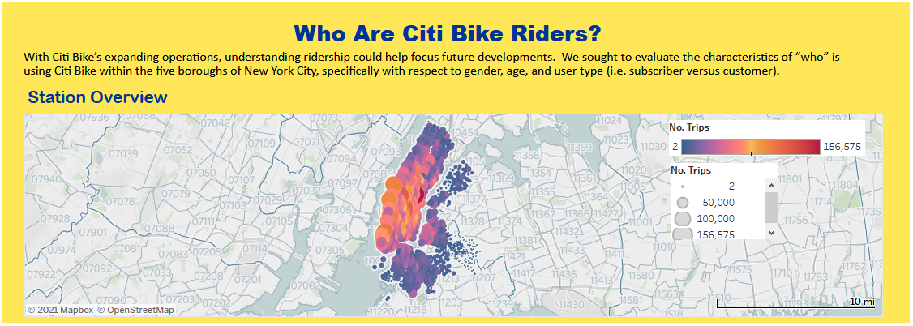
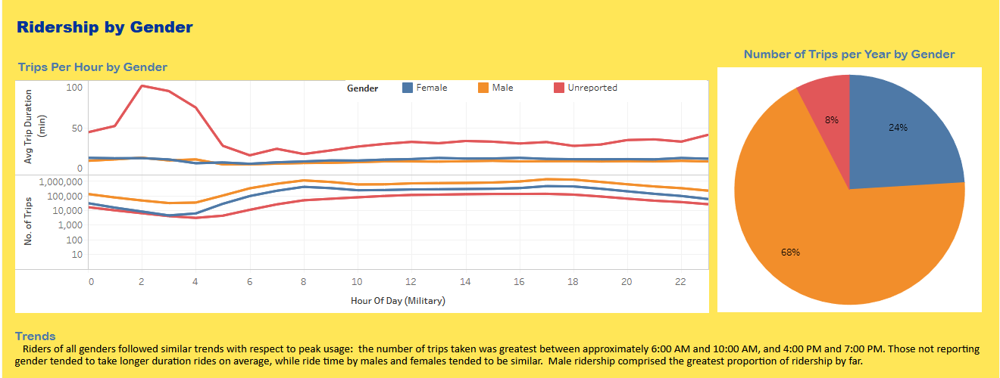
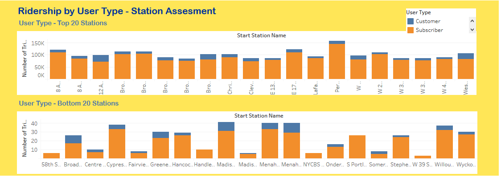
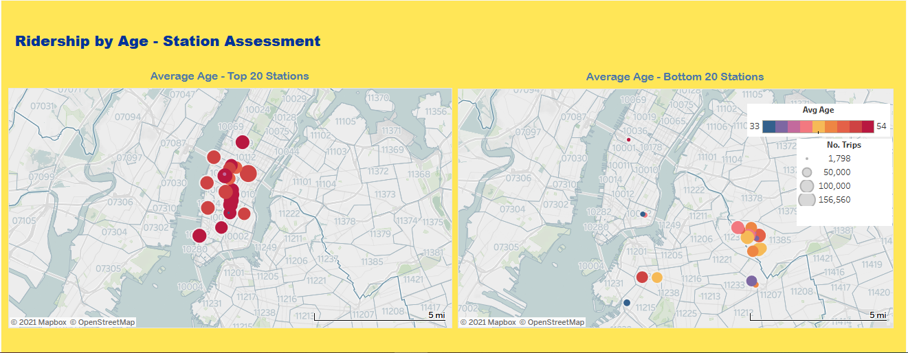
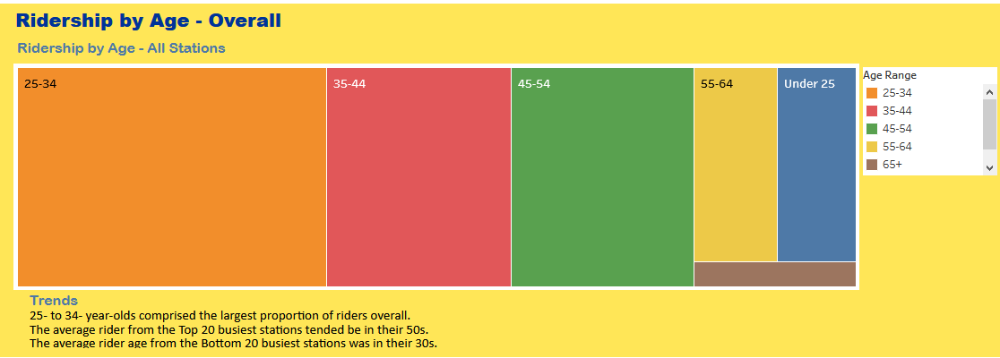
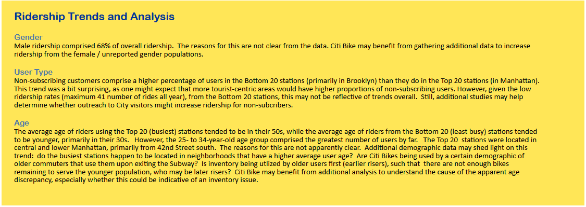

# Who Are Citi Bike Riders!

## Table of contents
* [Assignment](#assignment)
* [Data Sources](#data_sources)
* [Data Cleaning](#cleaning)
* [Data in Tableau](#tableu)
* [Story](#story)
* [Trends and Analysis](#trends)
* [References](#ref)

## Assignment
Evaluate Citi Bike data for possible trends and improvements. Prepare a presentation for City Officials using Tableau.  The Tableau Story was published through Tableau Public and can be found  at the following link:   
https://public.tableau.com/shared/RN6957PP6?:display_count=y&:origin=viz_share_link  

## Data Sources
Citi Bike background: https://en.wikipedia.org/wiki/Citi_Bike
Citi Bike data: 
* main page: https://www.citibikenyc.com/system-data 
* zip files: https://s3.amazonaws.com/tripdata/index.html

Monthly data from calendar year 2019 was selected to provide an analysis of Citi Bike usage throughout the five boroughs of New York City.  
CSV files downloaded from the Citi Bike website were too large to upload to git hub without creating push issues. Tableau can be run from the csv files already
created. However, if re-creation of these files is desired, prior to running the jupyter notebook data_cleanup.ipynb, execute the following steps: 

1. Download the following zip files from https://s3.amazonaws.com/tripdata/index.html
201901-citibike-tripdata.csv.zip
201902-citibike-tripdata.csv.zip
201903-citibike-tripdata.csv.zip
201904-citibike-tripdata.csv.zip
201905-citibike-tripdata.csv.zip
201906-citibike-tripdata.csv.zip
201907-citibike-tripdata.csv.zip
201908-citibike-tripdata.csv.zip
201909-citibike-tripdata.csv.zip
201910-citibike-tripdata.csv.zip
201911-citibike-tripdata.csv.zip
201912-citibike-tripdata.csv.zip

2. Extract the csv files, and save them to a directory with the following path name relative to the jupyter notebook: 
/citibike_downloads

3. ***NOTE*** Do not open csv file in Excel prior to loading into pandas; doing so will create an error in the date formatting.
If a previous of the fields within the csv files is desired, make a copy.  

4. Run the jupyter notebook

## Data Cleaning

The csv files for each month of 2019 were loaded into Jupyter Notebook and manipulated using Pandas. Dataframes from each csv were merged into one. 
Date fields were split into date, hours, minutes, and seconds. Unwanted columns were dropped. Columns were renamed to remove spaces, to facilitate 
header flattening later (for two-line headers created using dataframe.groupby). Aggregation methods were performed to group the data into useful 
categories and reduce the size of the dataset overall, for better performance in Tableau. The following dataframes were created. Groupby index 
headers were flattened, and each dataframe was exported to a csv file; the csv files were imported into Tableau for use in visualizations. The
following dataframes/csvs were created: 
* gender_trips - showing trip duration information (min, mean, max, count) by hour of day, date and gender 
* usertype_trips - showing trip duration information (min, mean, max, count) by hour of day, date and user type
* age_trips - showing trip duration information (min, mean, max, count) by hour of day, date, and birth year (used to calculate age)
* rides_day - showing the count of trips per day
* start_sta - showing information for trip duration (min, mean, max, count), birth year (min, max), start station latitude, and start station
longitude per station name and usertype 
* start_sta_age - showing information for trip duration (min, mean, max, count), birth year (min, max), start station latitude, and start station
longitude per station name and birth year 

Field Units and Definitions:
Trip Duration (seconds)
User Type (Customer = 24-hour pass or 3-day pass user; Subscriber = Annual Member)
Gender (Zero=unknown; 1=male; 2=female)

## Data in Tableau
Data was further manipulated in Tableau as needed to create groups and calculate fields for plotting and visualizations.  
* It is noted that busiest stations were identified by number of start trips from that station.  
* Birth year data included people aged over 140 years. Where age was used for plotting or calculations, birth year was filtered to include only those values from 1919 to 2019. 
* Trip duration was converted into minutes (rather than seconds) where necessary.   
* Top 20 and Bottom 20 stations, based on number of start trips, were utilized to evaluate age and user type trends.  

## Story 

#### Opening

#### Gender 

#### User Type by Station

#### User Type 

#### Age by Station 

#### Age Overall 

## Trends and Analysis 

## References
README Images
* https://www.nytimes.com/2019/07/16/nyregion/citi-bike-nyc-bronx.html

